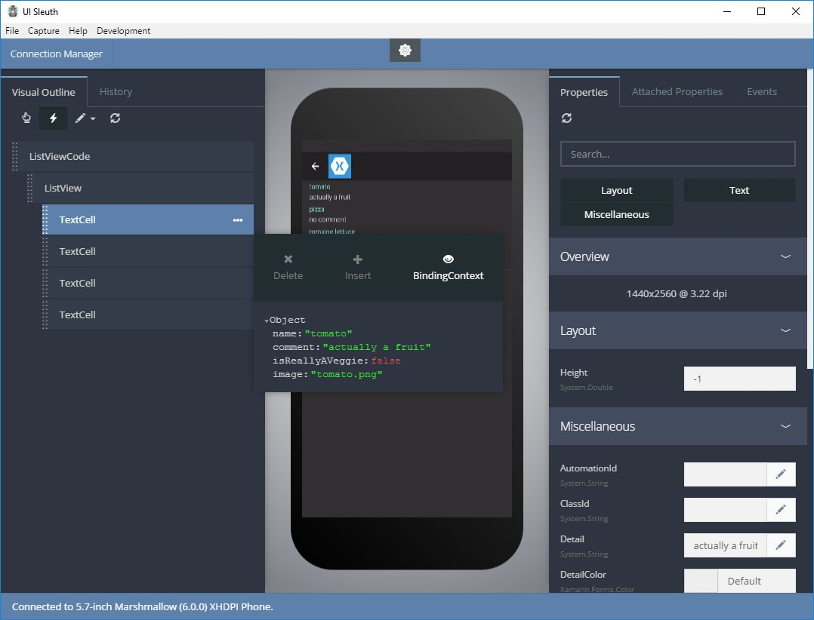

<p align="center">
  <a href="http://www.uisleuth.com">
    
  </a>

  <h3 align="center">UI Sleuth</h3>

  <p align="center">
    A Xamarin.Forms Inspector
    <br>
    <br>
    <a href="https://github.com/michaeled/uisleuth-downloads/releases">Download Desktop Client</a>
    &middot;
    <a href="https://www.nuget.org/packages/UISleuth/">Download NuGet Package</a>
    &middot;
    <a href="https://github.com/michaeled/uisleuth/wiki/Installation-Guide">Installation Guide</a>
    &middot;
    <a href="https://github.com/michaeled/uisleuth/wiki">Wiki</a>
  </p>
</p>
<br>

# What is UI Sleuth?

UI Sleuth is a Xamarin.Forms debugging tool. If you’ve ever made a web site, it’s similar to Microsoft’s F12 tools or Chrome Developer Tools. You can use it to efficiently track down layout issues, prototype a new design, and remotely control a device.

# Screenshots

<p align="center">
    
  <br>
    <small>Attached to Android tablet.</small>
</p>

<p align="center">
    
  <br>
  <small>Inspecting a ViewModel</small>
</p>

## Overview

UI Sleuth is composed of two components: the desktop client and the design server. The desktop client communicates with your mobile app via WebSockets and a simple JSON protocol. The .NET library that you reference in your Xamarin.Forms application is a WebSocket server and workflow engine. 

The workflow engine is implemented using a `BlockingCollection` that dispatches incoming messages to listeners, called `Reaction`s. Once a request has been received, its serialized into the appropriate .NET type. Each request type is associated with a reaction. When the corresponding reaction is determined, its instantiated and invoked. The implementing reaction can read the incoming message, perform some behavior, and return a response to the client.

As an example, the following code is used to respond to a screenshot request from the desktop client.

### 1) Define the request and response types (server code)

```
namespace UISleuth.Messages
{
    internal class ScreenShotRequest : Request {}

    internal class ScreenShotResponse : Response
    {
        public byte[] Capture { get; set; }
    }
}
```

### 2) Create a custom reaction class (server code)

```
    internal class ScreenShotReaction : Reaction
    {
        protected override void OnExecute(UIMessageContext ctx)
        {
            var request = ctx.Get<ScreenShotRequest>();
            if (request == null) return;

            var screenshot = InspectorContainer.Current.Resolve<IScreenShot>();
            byte[] capture = null;

            Thread.Invoke(() =>
            {
                capture = screenshot.Capture();
            });

            ctx.SetResponse<ScreenShotResponse>(r =>
            {
                r.Capture = capture;
                r.Suggest<GetVisualTreeRequest>();
            });
        }
    }
```

### 3) Associate the request type to the reaction (server code)

```
Reaction.Register<ScreenShotRequest, ScreenShotReaction>();
```

### 4) Request a screenshot via WebSocket (client code)

```
websocket.send("{action: 'ScreenShotRequest'}");
```

The `action` property above matches the C# type name of `ScreenShotRequest`.
Additional parameters can be present in this message. Utility methods exist to easily deserialize these messages into the appropriate .NET objects.

\* _Request types are optional. You may chose to send an OkResponse_

## Why WebSockets?

When this project started, Xamarin.Forms was a UI toolkit for iOS, Android, and Windows Phone apps only. I needed a simple, out of process way to communicate with external emulators and devices. WebSockets just made sense.

Now that we're seeing Xamarin.Forms target WPF, GTK#, and macOS a whole new level of possibilites for UI Sleuth are emerging. Let's imagine your new client wants to communicate with your Xamarin.Forms app via IPC instead of WebSockets for out-of-process communication. That's great; start by extending the `InspectorSocket` type and register it with the DI service.

# Documentation

This project site is a work in progress. 
You can find all the documentation on the [project's Wiki](https://github.com/michaeled/uisleuth/wiki).

[@mykldavis](https://twitter.com/mykldavis)
